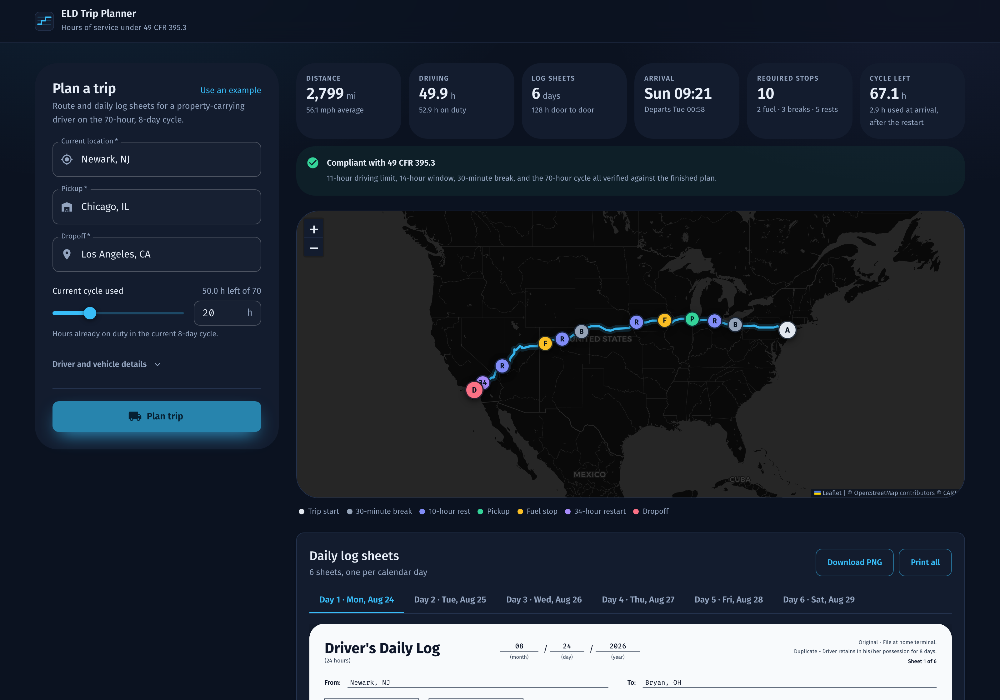
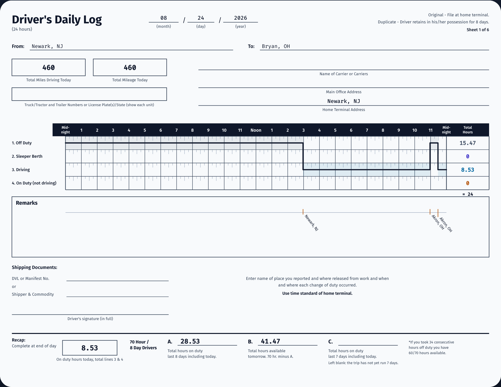

# ELD Trip Planner

Enter where a driver is, where the load is picked up and dropped off, and how
much of the 70-hour cycle is already spent. Get back a route with every stop
the federal rules require, and a drawn daily log sheet for each day of the
trip.

Built for the Spotter AI full-stack assessment.

| | |
| --- | --- |
| Live app | https://spotter-eld-trip-planner-sepia.vercel.app |
| API | https://spotter-eld-api-ok80.onrender.com |
| Walkthrough | https://www.loom.com/share/731b862561f64d17804e7f8b80bfbf74 |

---

## What it does



Four inputs go in. A route, a stop list and one sheet per calendar day come
back.



The sheet is a redraw of the paper form the FMCSA prints, filled from the
plan: the black hour strip, four duty rows over a quarter-hour grid, the
stepped duty line, per-row totals, remarks ticked at the hour they happened,
and the 70-hour recap.

## The hours-of-service engine

This is the part worth reading. `backend/apps/planner/hos.py` walks the route
minute by minute and asks one question before every stretch of driving: how
long may this driver keep going? The answer is the smallest of four numbers.

```python
def _drive_budget(self) -> float:
    return min(
        self.rules.driving_limit_hours - self.clock.drive_since_reset,
        self.rules.duty_window_hours - self.clock.window_elapsed(),
        self.rules.driving_before_break_hours - self.clock.drive_since_break,
        self.rules.cycle_limit_hours - self.clock.cycle_used,
    )
```

When the budget runs out, the planner picks the cheapest remedy that actually
clears the block: 30 minutes off driving if the break is what expired, 10
hours in the sleeper if the 11-hour drive limit or the 14-hour window did, and
a 34-hour restart if the 70-hour cycle did.

Three details separate this from a rough approximation:

**The 30-minute break is satisfied by any 30 consecutive minutes not
driving.** That is the 2020 final rule. The hour spent loading at the pickup
clears it, so no separate break is drawn, and the shape of the first day
changes because of it.

**`audit()` is a second implementation of the same four limits.** It re-walks
every finished plan and asks whether the regulation was met. A bug in the
planner shows up as a violation rather than being confirmed by the logic that
caused it. It runs on every request and its verdict ships in the response.

**Recap box C is left empty until the trip has run seven days.** The driver
supplies one cycle figure with no day-by-day breakdown, so before then there
is nothing to put in that box but a guess. Printing an invented number on a
federal form is worse than leaving it blank.

## How it is put together

```
backend/
  apps/planner/
    places.py      31,000 US places, resolved offline, no geocoding key
    routing.py     one OSRM call per trip, then a mileage profile
    hos.py         the simulator above, pure Python, no I/O
    logsheet.py    the plan cut into one drawable sheet per calendar day
    services.py    orchestration, caching, response building
frontend/
  src/components/
    logsheet/      the SVG form and its geometry
    RouteMap.tsx   Leaflet, drawn rather than flicked on
    TripForm.tsx   the four inputs
```

**One routing call per trip.** Current, pickup and dropoff go out as a single
three-waypoint request. The result carries a cumulative mileage profile scaled
onto the provider's reported total, so any mile marker interpolates to a point
on the line. A dozen stops per trip would otherwise be a dozen more calls.

**Places resolve without a network call.** A trimmed GeoNames gazetteer of
31,000 US places ships in the repo. It loads in 385 ms and holds 37 MB, which
matters because the free tier allows 512 MB. `build_places` rebuilds it from
the GeoNames dump, taking canonical names only.

**Nothing needs an API key.** OSRM for routing, OpenStreetMap and CARTO for
tiles, GeoNames for places. All free, all keyless.

## API

| Method | Path | Purpose |
| --- | --- | --- |
| `POST` | `/api/v1/trips/` | Plan a trip |
| `GET` | `/api/v1/trips/<id>/` | Fetch a planned trip |
| `GET` | `/api/v1/places/suggest/?q=` | Autocomplete |
| `GET` | `/api/v1/health/` | Liveness |

Every failure answers in one shape:

```json
{ "error": { "code": "route_not_found", "message": "...", "detail": {} } }
```

## Running it

```bash
git clone https://github.com/M-Shehzam/spotter-eld-trip-planner
cd spotter-eld-trip-planner

python3 -m venv .venv && source .venv/bin/activate
pip install -r backend/requirements.txt -r backend/requirements-dev.txt
python backend/manage.py migrate
python backend/manage.py runserver 8000

cd frontend && npm install && npm run dev
```

The frontend expects the API at `http://127.0.0.1:8000`. Point it elsewhere
with `VITE_API_BASE`.

## Tests

```bash
cd backend && pytest          # 297 tests
cd frontend && npm test       # 15 tests on the sheet geometry
```

The backend suite covers the hours-of-service rules case by case: the 11-hour
limit, the 14-hour window, the break that the pickup satisfies, the 34-hour
restart, day boundaries at midnight, and plans that the audit should reject.

```bash
cd e2e && npm run setup && npm test    # 28 checks against the hosted app
```

The end to end suite drives the deployed app in a real browser: validation,
keyboard order, a real plan, 24 hours accounted on every sheet, sheet mileage
against route distance, shared links, PNG export, print output, four viewport
widths, an axe WCAG 2.1 AA audit, reduced motion, and a mocked failure. It
runs against the hosted URLs rather than a local server, because that is what
the assessment is graded on. See `e2e/README.md`.

## Deploying

`render.yaml` describes the API. Point Render at the repo and apply the
blueprint. The frontend is a Vite build on Vercel with `VITE_API_BASE` set to
the Render URL.

Render stops a free instance after fifteen idle minutes, so a scheduled
workflow pings the health endpoint every ten.
